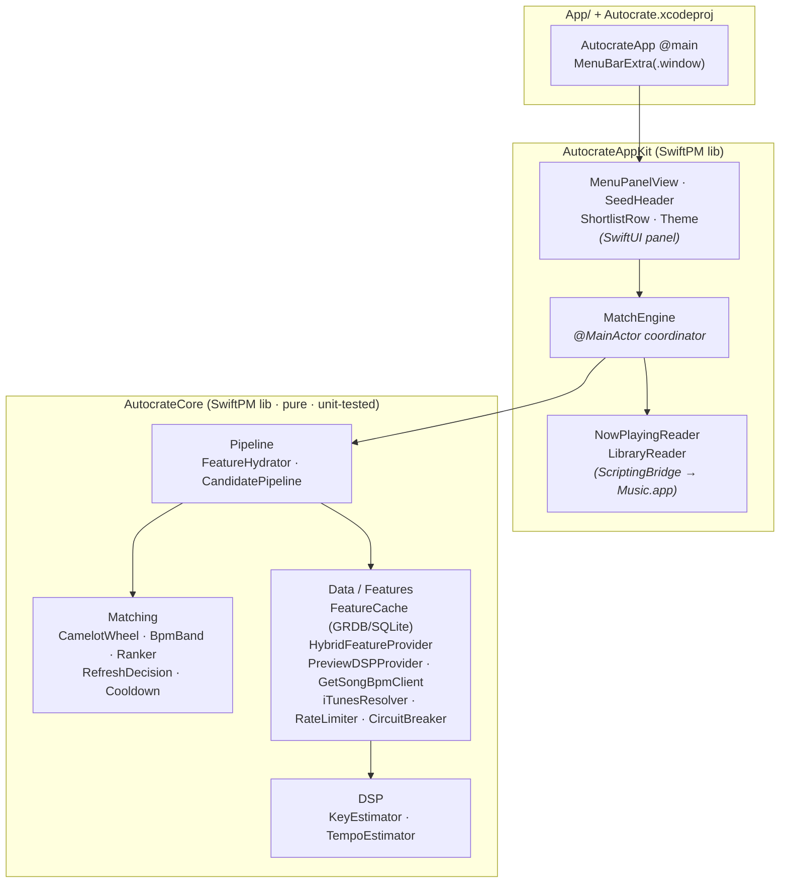
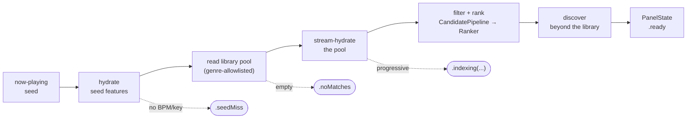
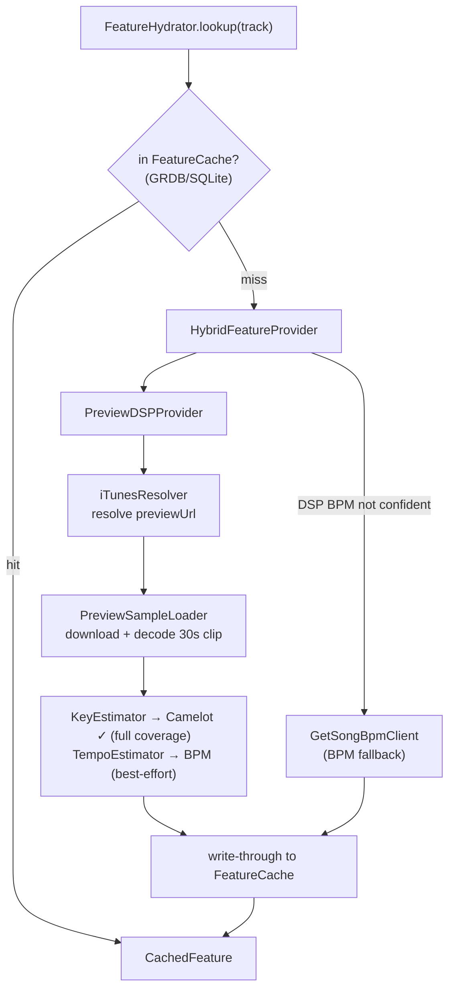
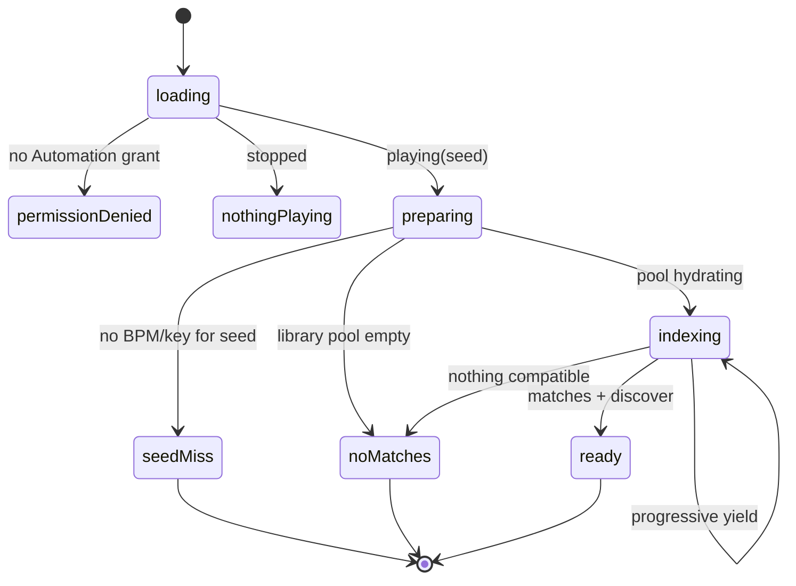

# How Autocrate Works

Autocrate is a native macOS menu-bar utility for Apple Music. It reads the **now-playing track** as a
seed, derives its **tempo (BPM)** and **key (Camelot)**, and surfaces a ranked shortlist of
harmonically- and tempo-compatible tracks to play next.

It does **not** mix. Apple Music's AutoMix handles playback transitions; Autocrate curates the setlist
AutoMix runs on. v1 is *show-only* — you add the picks to your own queue.

---

## 1. The three layers

The code is split so that all the logic is testable without a GUI. Pure logic lives in a headless
library; the AppKit/SwiftUI layer is a thin shell over it.



| Layer | Responsibility | Tested |
|-------|----------------|--------|
| **`AutocrateCore`** | Matching logic, feature cache, feature providers, DSP estimators, filter+rank pipeline. No AppKit/UI. | Headless XCTest (the whole suite) |
| **`AutocrateAppKit`** | ScriptingBridge readers, the `MatchEngine` coordinator, the SwiftUI panel + theme. | Compile-checked headlessly |
| **`App/` + `Autocrate.xcodeproj`** | Thin `@main` + Info.plist shell that links `AutocrateAppKit`. | Built/run from Xcode (⌘R) |

---

## 2. The data flow

`MatchEngine.refresh()` is the spine. It turns the now-playing seed into a single `PanelState` the
panel renders, emitting **intermediate states** so the panel never looks dead while slow lookups run.



1. **Seed** — `NowPlayingReader` reads the current track from Music.app via ScriptingBridge.
2. **Hydrate seed** — resolve the seed's BPM/Camelot through the feature provider (see §3). No key →
   `.seedMiss`.
3. **Read pool** — `LibraryReader` returns the library, filtered to a **genre allowlist**.
4. **Stream-hydrate** — the pool is hydrated progressively; matches and a climbing scan count surface
   as the library warms (`.indexing`).
5. **Filter + rank** — `CandidatePipeline.shortlist` gates candidates on the allowlist + BPM band +
   Camelot relation, then `Ranker` orders them.
6. **Discover** — widen beyond the library (see §5).
7. **Emit** — a single `.ready(seed, matches, discover)` (or `.noMatches`).

---

## 3. Feature provision (the swappable seam)

A track's BPM/key has to come from *somewhere* — Apple Music exposes no local BPM/key tags. The
abstraction is `FeatureProvider`:

```swift
func lookup(artist:title:id:) async -> CachedFeature   // always returns .found or .miss
```

It **always** returns a `CachedFeature` so the hydrator can persist every outcome — each track is
fetched at most once, then served from cache forever (BPM/key are immutable, so the cache has no TTL).



**Hybrid, key-dominant.** Camelot always comes from **on-device DSP** of Apple's free ~30s preview
clips (reliable, full coverage). BPM comes from DSP when confident, else is backfilled from
**GetSongBPM**, else is left `nil`. Resolving each preview URL goes through the **iTunes Search API**,
which is rate-limited — so there is no background pre-warm; each panel open resolves only a bounded,
paced batch, and coverage builds gradually across normal use.

---

## 4. Matching (pure, `AutocrateCore/Matching`)

All three are pure value logic with full unit coverage.

- **`CamelotWheel.relation`** — harmonic compatibility ranked `perfect > relative > adjacent`;
  incompatible → `nil`. (Energy-boost and diagonal moves are deliberately excluded in v1.)
- **`BpmBand.evaluate`** — a ±6% tempo band; half-time and double-time matches are allowed but flagged
  `tempoShifted`; out of band → `nil`.
- **`Ranker`** — the Camelot relation weight dominates the score; BPM closeness breaks ties; an exact
  tempo match beats a tempo-shifted one.

`CandidatePipeline.shortlist` applies the genre allowlist + BPM + Camelot gates to library candidates;
`shortlistDiscover` skips the genre gate (discover candidates carry no library genre tag).

---

## 5. Discover (beyond the library)

When the seed has both BPM and key, Autocrate widens past your own library: it asks GetSongBPM for
tempo/key-compatible songs, then **confirms each on Apple Music** through `iTunesResolver` (so every
discover pick is actually playable). Confirmed tracks are ranked by `shortlistDiscover` and shown under
a separate "DISCOVER — not in your library" heading.

---

## 6. The panel state machine

`MatchEngine` publishes one `PanelState`; `MenuPanelView` renders it. The intermediate states keep the
UI alive during slow lookups.



---

## 7. Refresh lifecycle — persistence, gating, live-follow

The panel is a `MenuBarExtra(.window)`, which **rebuilds its content view every time the panel opens**.
To keep results across opens and to follow track changes, ownership and triggering are arranged
carefully:

- **The engine persists at App scope.** `AutocrateApp` holds `MatchEngine` as a `@StateObject` and
  injects it into `MenuPanelView` as an `@ObservedObject`. The engine (and its published state) outlives
  every panel rebuild — reopening shows the last results instantly.
- **Re-query is gated on track identity.** `RefreshDecision.evaluate(currentSeedID:newSeedID:)` returns
  `.skip` when the on-screen seed matches the live now-playing track, `.refresh` otherwise. A same-track
  reopen does one cheap local read and nothing else — no wasted, rate-limited network work.
- **The panel follows the song live.** While open, `MenuPanelView` polls `refreshIfNeeded()` every 2s
  via `.task` (cancelled on dismiss, so polling stops when closed). The poll only *nudges* the engine;
  the actual refresh runs in an unstructured `Task` the **engine** retains, so closing the panel
  mid-scan never cancels hydration.
- **A track change supersedes the stale query.** `startRefresh()` cancels the in-flight refresh and
  starts a new one; `refresh()` checks `Task.isCancelled` after each `await`/loop step (and in
  `discover`) so a superseded refresh bails before it can clobber the new one's state — and before it
  burns more rate-limited iTunes calls.
- **Manual refresh, hard-limited.** A refresh button forces a re-query of the current track. It is
  capped at **once per 60s** by the pure `Cooldown` type, whose timestamp lives on the persisted engine
  so reopening the panel can't reset the limit.

```mermaid
sequenceDiagram
    participant U as User / Music.app
    participant V as MenuPanelView (.task poll)
    participant E as MatchEngine (@StateObject)
    participant R as refresh Task (engine-owned)

    U->>V: open panel
    V->>E: refreshIfNeeded()
    E->>E: RefreshDecision (new track) → .refresh
    E->>R: startRefresh()
    R-->>V: .preparing → .indexing(...) → .ready

    Note over V,E: every 2s while open
    V->>E: refreshIfNeeded()
    E->>E: same track → .skip (no work)

    U->>U: song changes
    V->>E: refreshIfNeeded()
    E->>E: track changed → .refresh
    E->>R: cancel stale + startRefresh()
    R-->>V: re-query for the new song

    U->>V: dismiss panel
    Note over V: poll .task cancelled; engine's refresh Task keeps running
```

---

## 8. Staying under the rate limit

Resolving preview URLs and confirming discover picks both hit the iTunes Search API, which rate-limits
per IP. Two safeguards live in `AutocrateCore/Data`:

- **`RateLimiter`** — a shared actor that spaces all iTunes calls a minimum interval apart, so every
  call site draws from one budget instead of each blowing past the limit.
- **`CircuitBreaker`** — a process-wide breaker that trips on a 403/429/5xx/network failure and halts
  *all* iTunes calls for a cooldown window (half-open afterward), so a transient block doesn't cascade
  into repeated hammering.

Transient failures are **not cached** (so they retry later rather than poisoning the cache), while
genuine BPM/key results are cached permanently.

---

## Build & test

```sh
swift test          # AutocrateCore unit tests
swift build         # both library targets + both probes
xcodegen generate   # regenerate Autocrate.xcodeproj from project.yml
```

The shipping app is built and run from **Xcode (⌘R)** — it needs an app bundle, Info.plist, bundled
fonts, and a TCC Automation entitlement to talk to Music.app. See [`App/README.md`](App/README.md) for
the full setup and the manual verification checklist.
